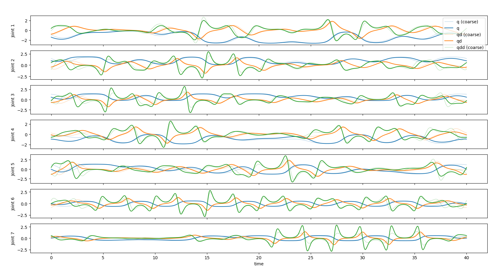

# 机器人系统辨识 — 激励轨迹生成

本项目用于双足机器人（biped_s49）左臂/右臂的激励轨迹生成，后续可扩展到轮臂，通过更改urdf文件即可，通过优化傅里叶级数参数，最小化回归矩阵的条件数，从而提高系统辨识精度。

## 项目结构

```
.
├── experiments/
│   └── generate_excitation.py    # 主脚本：激励轨迹生成
├── system_identification/
│   ├── utils.py                  # 工具函数（路径查找、QR分解、惯性转换等）
│   ├── inertia_model.py          # 惯性模型（基于 Pinocchio 的回归矩阵计算）
│   ├── excitation_generator.py   # 傅里叶轨迹生成（含 tanh 有界映射）
│   └── excitation_optimization.py# 优化目标函数与约束构建
├── robot_description/
│   └── biped_s49_description/
│       └── urdf/                 # 机器人 URDF 模型（左臂/右臂/全身）
├── traj_data/
│   └── csv_data/                 # 生成的轨迹 CSV 文件
├── environment.yml               # Conda 环境配置
└── setup.py                     # Python 包安装配置
```

## 安装环境

### 1. 安装 Conda

从 https://docs.conda.io/en/latest/miniconda.html 下载并安装 Miniconda 或 Anaconda。

### 2. 添加 conda-forge 频道

```bash
conda config --append channels conda-forge
```

### 3. 创建虚拟环境

```bash
conda env create -f environment.yml
```

### 4. 安装项目包

```bash
pip install -e .
```

### 5. 激活环境

```bash
conda activate sysid
```

## 运行脚本

### 基本用法

```bash
python experiments/generate_excitation.py
```

默认使用 `biped_s49_left_arm` 机器人模型，带 tanh 有界映射，执行全局粗搜索 + 局部精细优化。

### 可用机器人模型

通过 `--robot` 指定 URDF 名称（不含 `.urdf` 后缀）：

| 机器人 | 说明 |
|--------|------|
| `biped_s49_left_arm` | 双足机器人左臂（默认） |
| `biped_s49_right_arm` | 双足机器人右臂（与左臂 Y 轴镜像对齐） |

示例：

```bash
python experiments/generate_excitation.py --robot biped_s49_right_arm
```

## 命令行参数

| 参数 | 类型 | 默认值 | 说明 |
|------|------|--------|------|
| `--excite_type` | str | `condFriction` | 激励轨迹优化目标。可选：`cond`（纯惯性条件数）、`coverage`（位置覆盖）、`condFriction`（惯性+摩擦条件数） |
| `--robot` | str | `biped_s49_left_arm` | 机器人 URDF 名称 |
| `--optimizer` | str | `trust-constr` | 局部优化器。可选：`trust-constr`、`SLSQP` |
| `--fourier_order` | int | `8` | 傅里叶级数阶数 |
| `--fourier_duration` | int | `40` | 轨迹时长（秒） |
| `--friction_model` | str | `symmetric` | 摩擦模型。可选：`symmetric`（对称：tanh 库仑 + 线性粘性）、`asymmetric`（非对称：正负方向独立） |
| `--use_bounded` | flag | `True` | 使用 tanh 有界映射，保证关节位置在限位内（默认开启） |
| `--coarse_threshold` | float | `80.0` | 全局粗搜索的候选损失阈值，低于此值的候选被收集 |
| `--coarse_pop` | int | `50` | 差分进化种群大小 |
| `--coarse_gen` | int | `2` | 差分进化目标候选数量（收集够这么多合格候选后停止） |
| `--coarse_max_gen` | int | `500` | 差分进化硬性代数上限，达到此代数仍未收集够合格候选则强制进入下一阶段（用当前最优个体兜底填充） |
| `--soft_vel_penalty` | float | `5.0` | 粗搜索中的软速度惩罚权重（0 = 关闭） |
| `--max_local_time` | int | `180` | 局部优化最大耗时（秒），0 = 不限时 |
| `--constr_penalty` | float | `10.0` | trust-constr 约束惩罚初始值，越大约束执行越严格 |
| `--raw_limit` | float | `5.0` | tanh 饱和控制参数，限制傅里叶系数范数 `‖A_j‖²+‖B_j‖² ≤ (raw_limit/√order)²` |

## 优化流程

脚本分三个阶段运行：

1. **全局粗搜索**（Phase 1）：使用差分进化（DE）在参数空间中搜索条件数较低的候选轨迹，带系数范数约束防止 tanh 饱和。
2. **候选选择**（Phase 2）：从候选池中选择速度违约最小的候选作为局部优化初值。
3. **局部精细优化**（Phase 3）：使用 scipy.minimize（trust-constr 或 SLSQP）在约束下精细优化，约束包括初始速度/位置/加速度归零、速度/加速度限位、系数范数限界。

## 输出

- **轨迹图像**：弹出 matplotlib 窗口，显示优化前后各关节的位置/速度/加速度对比曲线（浅色虚线为粗搜索结果，深色实线为局部优化结果）。


- **CSV 文件**：保存到 `traj_data/csv_data/`，格式为 `t, q1...qN, v1...vN, a1...aN`，时间保留 3 位小位，位置/速度/加速度保留 6 位小数。

## 常用示例

```bash
# 默认运行（左臂，带 tanh 有界，惯性+摩擦条件数优化）
python experiments/generate_excitation.py

# 右臂，5 阶傅里叶，30 秒轨迹
python experiments/generate_excitation.py --robot biped_s49_right_arm --fourier_order 5 --fourier_duration 30

# 仅惯性条件数优化（不含摩擦）
python experiments/generate_excitation.py --excite_type cond

# 非对称摩擦模型
python experiments/generate_excitation.py --friction_model asymmetric

# 更严格的 tanh 饱和控制
python experiments/generate_excitation.py --raw_limit 2.0

# 增加粗搜索种群和候选数
python experiments/generate_excitation.py --coarse_pop 100 --coarse_gen 10

# 放宽粗搜索代数上限（让 DE 多跑几代再兜底），或收紧以快速进入局部优化
python experiments/generate_excitation.py --coarse_max_gen 1000   # 放宽到 1000 代
python experiments/generate_excitation.py --coarse_max_gen 50    # 快速测试，只跑 50 代

# 调整局部优化时间(10分钟), 少用无限时间, 非常容易振荡不收敛 
python experiments/generate_excitation.py --max_local_time 600
```

## TODO

### 一、无碰撞轨迹生成

#### 1. 现状：基于关节限位的碰撞规避

当前通过 **关节限位（joint limits）** 来近似“无碰撞”，实现方式如下：

- 关节运动范围直接取自 URDF 的 `upperPositionLimit` / `lowerPositionLimit`（见 `utils.pin_joint_config`）。
- `--use_bounded`（默认开启）启用 tanh 有界映射（`obtain_bounded_fourier_traj`），将傅里叶原始输出 `raw(t)` 经 `tanh` 映射到关节限位中心附近的安全区间

  `q(t) = q_center + 0.5·(q_upper − q_lower)·0.95 · tanh(raw(t))`

  从数学上保证 `q(t) ∈ [q_lower, q_upper]`，不会越出关节限位。
- 由于位置约束已由 tanh 映射保证，`constraints_velocity_only` 中 **仅保留速度 / 加速度 / 系数范数约束**，省去位置约束，降低优化规模、加快收敛。

**局限**：关节限位只能约束单关节角度范围，无法消除连杆之间的自碰撞（self-collision）或与外部环境的碰撞；为“安全”而过度收紧关节限位会牺牲工作空间与激励能力。

#### 2. 计划：笛卡尔边界约束（近似无碰撞、更快收敛）

引入 **显式笛卡尔边界限制** 替代 / 补充关节限位：

- 为末端（或关键连杆）定义一个用户指定的安全工作空间包围盒（axis-aligned bounding box 或凸多面体），如 `--cartesian_box xmin,ymin,zmin,xmax,ymax,zmax`。
- 在轨迹采样点上通过正运动学计算末端笛卡尔位置 `p(q(t)) = FK(q(t))`，将其作为 **非线性约束** 限制在包围盒内。
- 相比完整碰撞检测（对每个采样点做距离 / 碰撞查询），笛卡尔边界约束计算成本极低、约束面光滑，**优化器收敛更快**。
- 本质上是用“末端不出安全包围盒”来 **近似** 无碰撞——适用于工作空间几何已知、且末端路径可覆盖全部辨识工况的场景。

> 实现要点（待开发）：
> - 在 `constraints_velocity_only` 中追加 `NonlinearConstraint`，对每个采样点的末端笛卡尔位置施加盒约束；
> - 复用 `pinocchio.forwardKinematics` / `pinocchio.updateFramePlacement` 获取笛卡尔位置，避免重复建模；
> - 与现有 tanh 有界映射可叠加：tanh 保证关节限位，笛卡尔盒保证工作空间，二者协同收紧可行域。

---

### 二、回归矩阵场景整理

系统辨识观测方程为 `τ = Y(q, q̇, q̈) · π`，不同辨识场景对应不同的回归矩阵 `Y` 与待辨识参数 `π` 的组合。下表整理当前支持与计划扩展的场景。

#### 1. 当前支持的回归场景

| 场景 | `--excite_type` | 回归矩阵结构 | 待辨识参数 π | 说明 |
|------|-----------------|--------------|--------------|------|
| 纯动力学（惯性） | `cond` | `Y = Y_dyn` | 10 参数/关节（mass、lever×3、inertia×6） | 基于 `pinocchio.computeJointTorqueRegressor` 的标准 10 参数动力学回归子 |
| 惯性 + 对称库仑-粘性摩擦 | `condFriction`（`--friction_model symmetric`） | `Y = [Y_dyn, Y_fc_sym]` | 10 + 2 参数/关节（Fc, fv） | `Y_fc_sym` 由 `tanh(q̇/vc)` 库仑项与 `q̇` 线性粘性项构成，正负向共享一组参数 |
| 惯性 + 非对称库仑-粘性摩擦 | `condFriction`（`--friction_model asymmetric`） | `Y = [Y_dyn, Y_fc_asym]` | 10 + 4 参数/关节（Fc⁺, fv⁺, Fc⁻, fv⁻） | 正、负方向独立辨识库仑与粘性，`Y_fc_asym` 由 4 组方向相关特征构造 |
| 位置覆盖 | `coverage` | —（非回归场景） | — | 以关节行程覆盖最大化为目标，用于可达性 / 非参数辨识评估 |

> 说明：`Y_dyn` 由 `InertiaModel.regressor` 计算；摩擦回归子由 `generateSymFrictionReg` / `generateAsymFrictionReg` 生成，再与 `Y_dyn` 水平拼接；QR 降维（`QR_dim_reduction`）与条件数评估在拼接后的整体 `Y` 上进行。

#### 2. 计划扩展的回归场景

| 场景 | 回归矩阵结构 | 待辨识参数 π | 适用情形 |
|------|--------------|--------------|----------|
| 重力参数回归 | `Y = Y_g` | 每连杆 mass + CoM×3 | 静态 / 重力补偿标定，关节惯性已知时单独辨识质量与质心 |
| 惯性 + Stribeck 摩擦 | `Y = [Y_dyn, Y_stribeck]` | 10 + Stribeck 参数/关节（Fs、Δv 等） | 低速段存在负阻尼 / 静摩擦峰，需在 `tanh` 库仑-粘性基础上扩展 Stribeck 项 |
| 惯性 + 摩擦 + 电机转子惯量 | `Y = [Y_dyn, Y_fc, Y_rotor]` | 10 + 摩擦参数 + 转子惯量/齿轮比 | 关节带减速器，需辨识折算到关节侧的电机转子惯量 |
| 惯性 + 摩擦 + 关节柔性 | `Y = [Y_dyn, Y_fc, Y_stiff]` | 10 + 摩擦参数 + 刚度/阻尼 | 柔性关节机器人，辨识关节扭簧刚度与结构阻尼 |
| 纯摩擦回归 | `Y = Y_fc` | 摩擦参数/关节 | 惯性参数已知时单独辨识摩擦，减小参数维度与条件数 |
| 浮基 / 全身耦合回归 | `Y = Y_fullbody` | 含基座 6 自由度耦合参数 | 双足 / 轮臂全身动力学辨识，需处理浮基耦合 |

> 实现要点（待开发）：
> - 在 `excitation_optimization.py` 中为每个新场景新增对应的 `params2xxx` 目标函数；
> - 摩擦扩展场景需在 `utils.feature2regressor` 框架下追加新特征（如 Stribeck 速度项），复用现有 `feature → regressor` 流水线；
> - 在 `generate_excitation.py` 的 `--excite_type` 分支中接入新场景，并相应扩展 `optimizer_args` / `optimizer_input_args` 的参数传递。